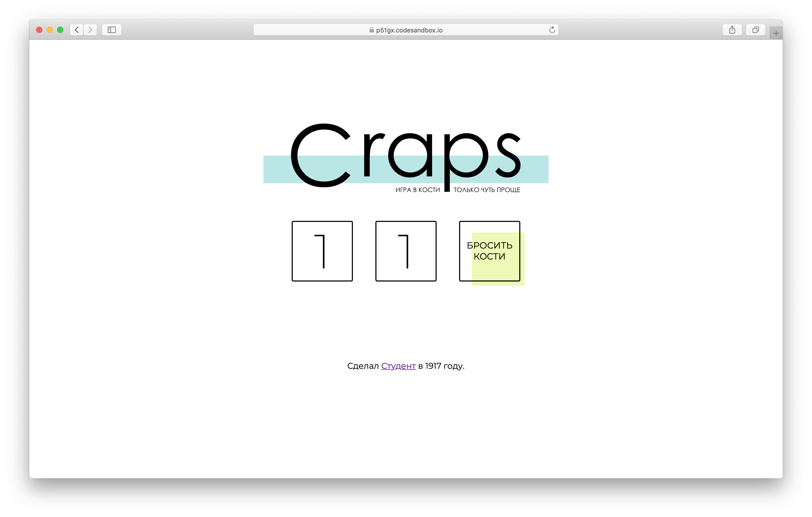

# Домашнее задание к лекции «Hello, World!»

Мы будем делать игру в кости — Крэпс. Немного упростим правила, но суть останется прежней. Бросается два кубика — в зависимости от суммы результатов, игрок или выиграл или проиграл или должен перекинуть кости.

Вертска (разметка и визуальное представление) игры уже готово, теперь нужно реализовать логику работы.

В проекте существует подпрограмма (небольшая часть программы) отвественная за бросание кубика. Сейчас она ничего не делает. Ваша задача — реализовать бросание кубика.

**Особые указания:**
+ Используйте `Math.random()` для получения случайного числа
+ Посмотрите на пример с бросанием монетки в лекции — монетка похожа на кубик

**Алгоритм работы:**
+ Откройте в папке `game` файл `rollDice.js`.
+ `Math.random()` возвращает случайное число в промежутке от 0 до 1, разделите этот промежут на 6 равных частей (грани кубика)
+ Внутри `rollDiece` сделайте несколько условий по аналогии с бросанием монетки для определения результата броска кубика
+ Используя ключевое слово `return` верните результат броска (число от 1 до 6)
