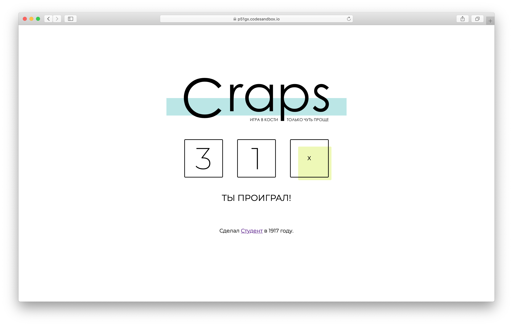

# Домашнее задание к лекции «Знакомство с JavaScript»

Мы будем делать игру в кости — Крэпс. Немного упростим правила, но суть останется прежней. Бросается два кубика — в зависимости от суммы результатов, игрок или выиграл или проиграл или должен перекинуть кости.

Верстка (разметка и визуальное представление) игры уже готово, а в прошлом домашнем задании вы реализовали логику броска. Теперь необходимо добавить выведение результата на экране.

В проекте существует подпрограмма (небольшая часть программы) отвественная за выведение результата на экран. Сейчас она всегда после броска выводит 1. Ваша задача — выводить результата настоящего броска.

## Как работать над проектом

1. Зарегистрируйтесь на сайте [CodeSandbox](https://codesandbox.io/).
2. Перейдите по [ссылке](https://codesandbox.io/s/sd-craps-p51gx).
3. Нажмите кнопку **Fork**.
4. Код пишите в левой части окна.
5. Посмотреть результат можно в правой части экрана.
6. После окончания работы сохраните файл (выберите _File > Save_), нажмите кнопку **Share**, затем кнопку  _Copy link_.
7. В личном кабинете на сайте [netology.ru](http://netology.ru/) в поле комментария к домашней работе вставьте скопированную ссылку и отправьте работу на проверку.

_Никаких файлов прикреплять не нужно._

## Как выполнять домашнее задание

+ Откройте в папке `game` файл `playGame.js`;
+ Внутри подпрограммы `playGame` замените присваивание единиц в `firstResult` и `secondResult`, вызовом своей подпрограммы — `rollDiece`.