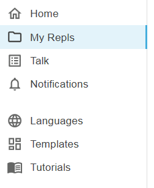
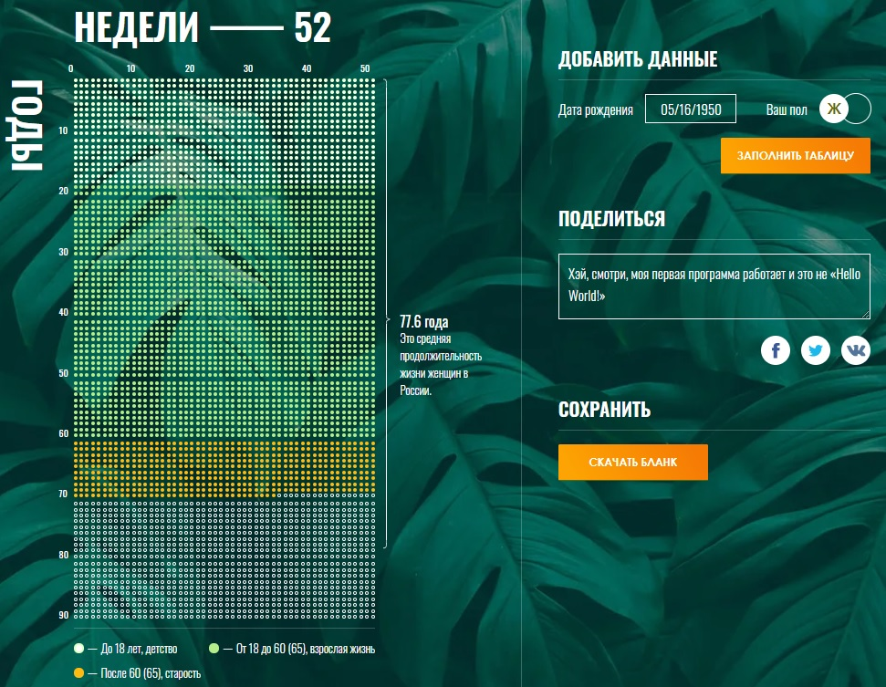

# Домашнее задание к лекции «Интернет — большая библиотека»

## Описание задания
Данное задание является заключительным в данном курсе.
В задании необходимо сделать две цепочки условного оператора.

### Перед работой
1. Зайдите на сайт [repl.it](https://repl.it/). Если нужно, введите логин и пароль.
2. Перейдите в раздел My Repls:

3. Откройте проект, который вы создали при выполнении первого домашнего задания. Если вы не переименовывали проект, он будет называться `SD diploma`.  
Кроме того, вы можете найти ссылку на ваш проект в личном кабинете Нетологии.

4. В списке файлов слева найдите файл с именем `hw-4.js` и кликните на него.

5. В открывшемся файле внимательно прочитайте комментарии к коду — серые строки после символов `//`.

## Задача №1
Первое условие должно быть в функции `calcRetiredAge`. 
1. Если значения аргумента `gender` является *truthy*, то присвойте в переменную `retireAge` значение 60.
2. Если значения аргумента `gender` является *falsy*, то присвойте в переменную `retireAge` значение 65.

## Задача №2
Второе условие должно быть в функции `colorizeDots` (в этой функции проверка будет выполняться на каждой итерации цикла).
1. Если значение перебираемой недели меньше произведения 18 (количества лет) на 52 (количество недель в году), то присвойте переменной `colorClass` значение `_young` (это детство).
2. Если значение перебираемой недели меньше, чем произведение retireAge на количество недель в году, то присвойте переменной `colorClass` значение `_adult` (это взрослая жизнь).
3. Если значение перебираемой недели больше либо равно произведению retireAge на количество недель в году, то присвойте переменной `colorClass` значение `_senior` (это старость).

Если все задания выполнены верно, то таблица будет выглядеть так:

