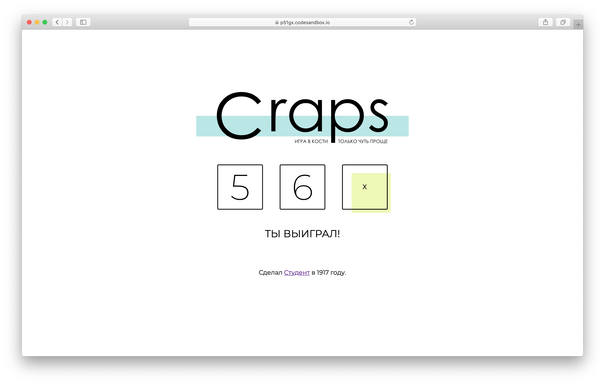

# Домашнее задание к лекции «Лайк, шер»

Мы будем делать игру в кости — Крэпс. Немного упростим правила, но суть останется прежней. Бросается два кубика — в зависимости от суммы результатов, игрок или выиграл, или проиграл, или должен перекинуть кости.

Вёрстка (разметка и визуальное представление) игры уже готова, а в прошлых домашних заданих вы реализовали логику броска и выведение результата на экран. Теперь необходимо добавить проверку на выигрыш.

В проекте существует подпрограмма (небольшая часть программы) отвественная за определение результата игры. Сейчас она всегда после броска выводит 0 (нужно перекинуть кубики). Ваша задача — проводить вычисления настоящего результата.

## Как работать над проектом

1. Зарегистрируйтесь на сайте [CodeSandbox](https://codesandbox.io/).
2. Перейдите по [ссылке](https://codesandbox.io/s/sd-craps-pd7zf).
3. Нажмите кнопку **Fork**.
4. Код пишите в левой части окна.
5. Посмотреть результат можно в правой части экрана.
6. После окончания работы сохраните файл (выберите _File > Save_), нажмите кнопку _Share_, затем кнопку  _Copy link_.
7. В личном кабинете на сайте [netology.ru](http://netology.ru/) вставьте скопированную ссылку в поле «Ссылка на решение» и отправьте работу на проверку.

_Никаких файлов прикреплять не нужно._

## Как выполнять домашнее задание

+ Откройте в папке `game` файл `checkResult.js`;
+ Внутри подпрограммы `checkResult` сложите результат броска первого кубика `firstResult` и результат броска второго кубика `secondResult`;
+ Результат сложения проверьте по следующим правилам:
  + Если сумма равна 7 или 11 — игрок победил, нужно вернуть 1;
  + Если сумма равно 2, 3 или 12 — игрок проиграл, нужно вернуть -1;
  + Во всех остальных случаях — игра продолжается, нужно вернуть 0.
+ Для возвращения результата используйте ключевое слово `return`.