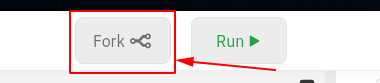
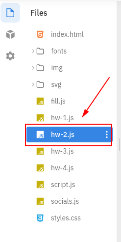
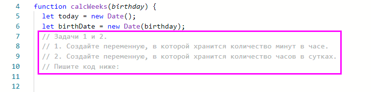
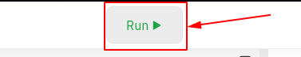
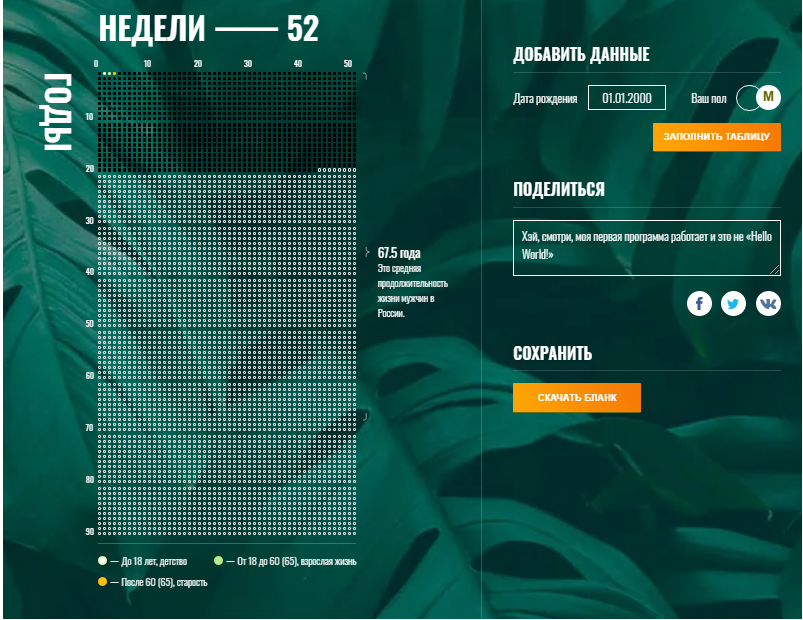
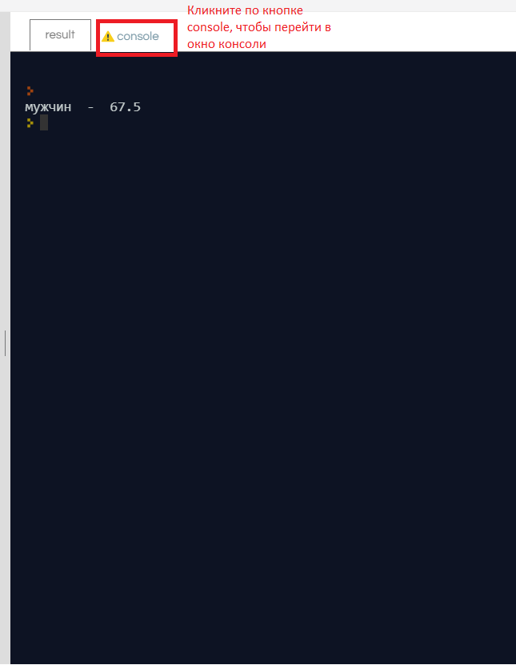

# Домашнее задание к лекции «Общаемся с компьютером»

По ходу нашего курса мы будем дорабатывать мотивационное веб-приложение, в котором пользователь может рассчитать сколько недель он прожил с дня его рождения до сегодняшнего дня. 

Вы можете открыть проект по [ссылке](https://repl.it/@netologySD/SD-diploma) и изучить его. 

В данный момент приложение работает некорректно. Нам с вами предстоит внести в него правки так, чтобы оно заработало правильно. В конце курса у вас получится полностью рабочее приложение, которым вы сможете поделиться со своими друзьями или опубликовать ссылку на него в социальных сетях. 

## Описание задания
На второй лекции вы изучили строки, узначи о способе склейки строк,   научились выводить в консоль данные, а так же форматировать код. 

Давайте отработаем полученные навыки. 

В данный момент неправильно работает функция отображения среднего возраста и пола. Чтобы ее исправить, нужно правильно выбрать переменные и присвоить им подходящие значения. Чтобы проверить себя, попробуйте вывести в консоль сведения о среднем возрасте и поле, разделив их тире. Так же Вам предстоит отформатировать код, согласно имеющегося кодстайла: https://github.com/netology-code/codestyle/tree/master/js

### Перед работой
1. Откройте проект по [ссылке](https://repl.it/@netologySD/SD-diploma)
2. Нажмите кнопку `Fork`


3.Скопируйте содержимое файла hw-1.js из вашей предыдущей работ в новый проект. Ссылки на предыдущие дз можно найти в личном кабинете на сайте Нетологии.

4. В списке файлов слева найдите файл с именем `hw-2.js` и кликните на него.


5. В открывшемся файле внимательно прочитайте комментарии к коду — серые строки после символов `//` и между символами `/* */`




## Задача №1
1. Найдите строчки кода, требующие форматирования и отформатируйте код так, чтобы он стал читабельным

## Задача №2
1. Мы создали две переменные:
```javascript
let middleAge; 
let genderName;
```
Ваша задача, определить, какие значения присвоить каждой из них.

## Задача №3
1. Создайте новую переменную и положите в нее результат склейки переменных middleAge и genderName. Воспользуйтесь функцией console.log(), чтобы вывести результат операции в консоль.

Теперь вычисления должны быть правильными. Проверим это!
1. Нажмите на кнопку `Run` 



2. В правой части окна появится наше веб-приложение. 
3. Выберите пол `М` и нажмите кнопку `Заполнить таблицу`
4. Если все задания выполнены верно, то надпись рядом с таблицей будет выглядеть так:


5. Перейдите на вкладку консоль - там Вы увидите сообщение, напечатанное функцией console.log():

